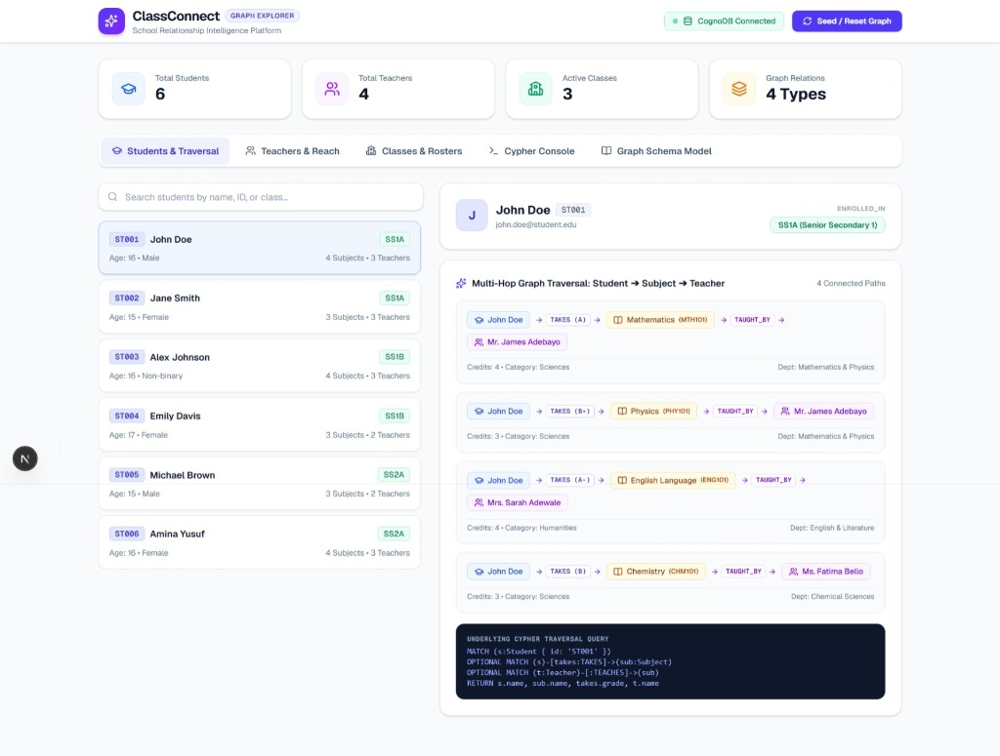

# 🎓 ClassConnect – School Relationship Intelligence & Graph Explorer

[](https://classconnectdb.netlify.app/)
[](https://nextjs.org/)
[](https://cognodb.cloud)
[](https://www.typescriptlang.org/)

**ClassConnect** is a modern, high-performance School Data & Relationship Intelligence web application built with **Next.js 16**, **TypeScript**, **Tailwind CSS**, and **CognoDB / Neo4j**. It models the interconnected academic ecosystem of a school—connecting students, teachers, classes, and subjects as a first-class property graph and exposing complex multi-hop relationship traversals via **Cypher** queries in real time.

🔗 **Live Application URL**: [https://classconnectdb.netlify.app/](https://classconnectdb.netlify.app/)

---

## 📑 Table of Contents
1. [Project Overview](#1-project-overview)
2. [Problem Statement](#2-problem-statement)
3. [Solution](#3-solution)
4. [Why a Graph Database?](#4-why-a-graph-database)
5. [Key Features](#5-key-features)
6. [Graph Data Model](#6-graph-data-model)
   - [Nodes & Properties](#labeled-nodes--properties)
   - [Relationships & Edge Properties](#typed-relationships)
   - [Data Model Diagram](#data-model-diagram)
7. [Technology Stack](#7-technology-stack)
8. [Application Architecture](#8-application-architecture)
9. [Database Setup (CognoDB & Neo4j)](#9-database-setup)
10. [Environment Variables](#10-environment-variables)
11. [Installation & Running Locally](#11-installation--running-locally)
12. [Seed Data](#12-seed-data)
13. [Main Cypher Queries Explained](#13-main-cypher-queries-explained)
14. [How the Application Works](#14-how-the-application-works)
15. [UI Screenshots](#15-ui-screenshots)
16. [Live Demo & Deployment](#16-live-demo--deployment)
17. [Project Structure](#17-project-structure)
18. [Future Improvements](#18-future-improvements)

---

## 1. Project Overview

School administrative and academic data is inherently **networked**. Students do not merely exist in isolation; they are enrolled in homeroom classes, attend specific subject courses, are instructed by faculty members from multiple academic departments, and share classes with peers.

**ClassConnect** provides school administrators, teachers, academic counselors, and students with an intuitive, interactive window into these interconnected relationships. Rather than flattening records into rigid relational tables, ClassConnect leverages **CognoDB** (a cloud-native graph database powered by the Cypher query language) to represent students, teachers, subjects, and classes as interconnected nodes and edges.

### Core Goals:
- Deliver real-time multi-hop academic path exploration (e.g., *Student ➔ Subject ➔ Teacher*).
- Provide institutional transparency into teacher student reach and department workloads.
- Provide an interactive, latency-benchmarked Cypher query playground for educational analysis.
- Give a single-pane-of-glass interface for class rosters, capacity utilization, and course enrollments.

---

## 2. Problem Statement

Traditional relational database management systems (RDBMS) model school information using separate tabular entities (`students`, `teachers`, `classes`, `subjects`) connected through intermediate junction/bridge tables (`student_subjects`, `class_students`, `teacher_subjects`, etc.). 

As questions become more relationship-centric, relational systems face major friction:
- **Relational "JOIN Hell"**: Answering a question like *"Which teachers teach student John Doe, what grades did he receive in their subjects, and who are his classmates taking the same courses?"* requires joining 5 to 7 tables simultaneously with complex `GROUP BY` and `WHERE` clauses.
- **Performance Degradation at Scale**: Relational joins compute Cartesian products at query time, creating significant computational overhead and memory pressure as enrollment and course history grow.
- **Rigid Schemas**: Adding relationship metadata (such as historical term grades, semester designations, or role-based assignments) requires modifying table definitions, foreign keys, and migration scripts.
- **Opaque Academic Pathways**: Counselors and administrators struggle to visualize multi-tier connections such as academic dependencies, teacher reach, and peer cohort overlaps.

---

## 3. Solution

**ClassConnect** solves these challenges by embracing **Graph-Native Modeling**:

- **First-Class Relationships**: Connections (`[:ENROLLED_IN]`, `[:TAKES]`, `[:TEACHES]`, `[:OFFERED_IN]`) are stored as physical pointers (Index-Free Adjacency), making multi-hop traversals virtually instantaneous regardless of overall database size.
- **Rich Relationship Metadata**: Grade records (`grade: 'A'`) and academic terms (`semester: 'Fall'`) are stored directly on the `[:TAKES]` edge between a student and subject.
- **Intuitive Cypher Queries**: Declarative pattern matching replaces nested SQL joins with expressive ASCII-art syntax (`(s:Student)-[:TAKES]->(sub:Subject)<-[:TEACHES]-(t:Teacher)`).
- **Interactive Full-Stack Web App**: Built with Next.js 16 and Tailwind CSS, giving users instant visual traversal maps, search filters, analytics, and an integrated Cypher console.

---

## 4. Why a Graph Database?

Graph databases (like **CognoDB** and **Neo4j**) are purpose-built for connected data. Below is a comparative breakdown of why graph modeling is superior to relational databases for school relationship intelligence:

| Dimension | Relational Database (RDBMS / SQL) | Graph Database (CognoDB / Cypher) |
| :--- | :--- | :--- |
| **Data Representation** | Tables, rows, foreign keys, junction tables | Nodes (entities), Edges (relationships), Properties (key-value) |
| **Relationship Traversal** | Expensive runtime `JOIN` operations across indexing tables | **Index-Free Adjacency** (direct pointer traversal in $O(1)$ per hop) |
| **Multi-Hop Queries** | Deeply nested joins; becomes slow and difficult to maintain | Simple pattern matching: `(a)-[:REL1]->(b)-[:REL2]->(c)` |
| **Edge Attributes** | Requires separate junction tables with artificial primary keys | Relationships natively store properties (`grade`, `semester`) |
| **Schema Flexibility** | Rigid schema migrations required for new relationship types | Flexible schema; easily add new node labels and edge types |
| **Intuitive Modeling** | Entity Relationship diagrams abstract away natural connections | The whiteboard model **is** the database model |

### Visual Comparison: Querying a Student's Teachers

#### Relational SQL Approach (Requires 5 Joins):
```sql
SELECT s.name AS student, sub.name AS subject, ss.grade, t.name AS teacher, t.department
FROM students s
JOIN student_subjects ss ON s.id = ss.student_id
JOIN subjects sub ON ss.subject_id = sub.id
JOIN teacher_subjects ts ON sub.id = ts.subject_id
JOIN teachers t ON ts.teacher_id = t.id
WHERE s.id = 'ST001';
```

#### Graph Cypher Approach (Declarative Pattern Match):
```cypher
MATCH (s:Student { id: 'ST001' })-[takes:TAKES]->(sub:Subject)<-[:TEACHES]-(t:Teacher)
RETURN s.name AS student, sub.name AS subject, takes.grade AS grade, t.name AS teacher, t.department AS department
```

---

## 5. Key Features

- 🔍 **Multi-Hop Traversal Explorer**: Select any student to visually trace and inspect complex multi-tier pathways:
  $$\text{Student} \xrightarrow{\text{[:TAKES]}} \text{Subject} \xleftarrow{\text{[:TEACHES]}} \text{Teacher}$$
  $$\text{Student} \xrightarrow{\text{[:ENROLLED_IN]}} \text{Class}$$
- ⚡ **Interactive Cypher Console**: Write, test, and execute custom Cypher queries in real time with query latency profiling and clean tabular output. Includes one-click preset queries.
- 👩‍🏫 **Teacher & Outreach Intelligence**: Track teacher course assignments, departmental distribution, and total unique student reach across all classrooms.
- 🏫 **Class Rosters & Capacities**: Monitor homeroom enrollments, maximum room capacities, utilization percentages, and offered curricula.
- 🌱 **One-Click Database Seeding**: Populate or reset graph nodes and typed relationships with sample academic records in seconds via `/api/db/seed`.
- 📊 **Interactive Graph Model Inspector**: Live documentation of all node labels, relationship types, and directional schemas built right into the UI.
- 🎨 **Responsive High-Contrast UI**: Modern glassmorphism layout, clean typography, badge indicators, and dynamic search filtering.

---

## 6. Graph Data Model

The application models a secondary school academic ecosystem containing **4 Node Labels** and **4 Typed Relationships**.

### Data Model Diagram

```text
                    ┌────────────────────────────────────────┐
                    │               (:Teacher)               │
                    │  id, name, email, department           │
                    └───────────────────┬────────────────────┘
                                        │
                                     TEACHES
                                        │
                                        ▼
┌──────────────────────────────┐      ┌──────────────────────────────┐
│          (:Student)          │─────▶│          (:Subject)          │
│ id, name, age, gender, email │ TAKES│ code, name, credits, category│
└──────────────┬───────────────┘      └──────────────┬───────────────┘
               │                                     │
          ENROLLED_IN                            OFFERED_IN
               │                                     │
               ▼                                     ▼
            ┌───────────────────────────────────────────┐
            │                  (:Class)                 │
            │        name, level, room, capacity        │
            └───────────────────────────────────────────┘
```

#### Mermaid Flowchart Representation
```mermaid
graph TD
    Teacher["👨‍🏫 :Teacher<br/><i>id, name, email, department</i>"]
    Student["🎓 :Student<br/><i>id, name, age, gender, email</i>"]
    Subject["📚 :Subject<br/><i>code, name, credits, category</i>"]
    Class["🏫 :Class<br/><i>name, level, room, capacity</i>"]

    Teacher -->|TEACHES| Subject
    Student -->|TAKES {grade, semester}| Subject
    Student -->|ENROLLED_IN| Class
    Subject -->|OFFERED_IN| Class

    style Teacher fill:#e0e7ff,stroke:#4338ca,stroke-width:2px;
    style Student fill:#dbeafe,stroke:#1d4ed8,stroke-width:2px;
    style Subject fill:#fef3c7,stroke:#d97706,stroke-width:2px;
    style Class fill:#dcfce7,stroke:#15803d,stroke-width:2px;
```

---

### Labeled Nodes & Properties

| Node Label | Description | Property | Type | Example |
| :--- | :--- | :--- | :--- | :--- |
| **`:Student`** | A student enrolled in the school | `id` | String (Unique) | `'ST001'` |
| | | `name` | String | `'John Doe'` |
| | | `age` | Integer | `16` |
| | | `gender` | String | `'Male'` |
| | | `email` | String | `'john.doe@student.edu'` |
| **`:Teacher`** | A faculty member | `id` | String (Unique) | `'T001'` |
| | | `name` | String | `'Mr. James Adebayo'` |
| | | `email` | String | `'james.adebayo@school.edu'` |
| | | `department` | String | `'Mathematics & Physics'` |
| **`:Class`** | An academic homeroom cohort | `name` | String (Unique) | `'SS1A'` |
| | | `level` | String | `'Senior Secondary 1'` |
| | | `room` | String | `'Room 101'` |
| | | `capacity` | Integer | `35` |
| **`:Subject`** | A curriculum course | `code` | String (Unique) | `'MTH101'` |
| | | `name` | String | `'Mathematics'` |
| | | `credits` | Integer | `4` |
| | | `category` | String | `'Sciences'` |

---

### Typed Relationships

| Relationship Type | Source Node | Target Node | Edge Properties | Description |
| :--- | :--- | :--- | :--- | :--- |
| **`[:ENROLLED_IN]`** | `(:Student)` | `(:Class)` | *None* | Connects a student to their assigned homeroom class. |
| **`[:TAKES]`** | `(:Student)` | `(:Subject)` | `grade` (String)<br/>`semester` (String) | Records the course a student is taking, along with their assigned letter grade (e.g. `'A'`, `'B+'`) and semester (`'Fall'`). |
| **`[:TEACHES]`** | `(:Teacher)` | `(:Subject)` | *None* | Designates a teacher's instructional subject assignment. |
| **`[:OFFERED_IN]`** | `(:Subject)` | `(:Class)` | *None* | Indicates that a course curriculum is available to students in that class. |

---

## 7. Technology Stack

- **Frontend Framework**: [Next.js 16](https://nextjs.org/) (App Router, Turbopack, React 19)
- **Language**: [TypeScript](https://www.typescriptlang.org/) (Strict Mode)
- **Styling**: [Tailwind CSS](https://tailwindcss.com/)
- **Icons**: [Lucide React](https://lucide.dev/)
- **Database Driver**: Official [neo4j-driver](https://www.npmjs.com/package/neo4j-driver) with Bolt Protocol (`bolt+s://` / `neo4j+s://`)
- **Graph Database Engine**: [CognoDB Cloud](https://cognodb.cloud) / [Neo4j](https://neo4j.com/)

---

## 8. Application Architecture

```text
┌────────────────────────────────────────────────────────┐
│                   Next.js 16 Client                     │
│  (React 19 Components, Tailwind CSS, Lucide UI Icons)  │
└───────────────────────────┬────────────────────────────┘
                            │ HTTP JSON API Requests
                            ▼
┌────────────────────────────────────────────────────────┐
│            Next.js Route Handlers (API Layer)          │
│   • /api/students     • /api/teachers                  │
│   • /api/classes      • /api/query (Cypher Runner)     │
│   • /api/db/health    • /api/db/seed                   │
└───────────────────────────┬────────────────────────────┘
                            │ Neo4j JavaScript Driver
                            │ Connection Pool & Session Management
                            ▼
┌────────────────────────────────────────────────────────┐
│             CognoDB / Neo4j Graph Database              │
│        (Bolt Protocol: Index-Free Adjacency & Cypher)   │
└────────────────────────────────────────────────────────┘
```

---

## 9. Database Setup

ClassConnect connects to any **CognoDB** cloud instance or **Neo4j** instance using the open Bolt protocol.

### Creating a CognoDB Cloud Database Instance:

1. **Sign Up / Log In**: Visit [CognoDB Cloud](https://cognodb.cloud) and log into your console.
2. **Create New Instance**: Click **"Create Database"** or **"New Instance"**.
3. **Select Region & Tier**: Choose your preferred cloud region and configuration.
4. **Copy Connection Details**: Once provisioned, note down:
   - **Connection URI**: e.g., `bolt+s://your-instance-id.databases.cognodb.cloud`
   - **Username**: `cognodb` (or your configured username)
   - **Password**: Your securely generated instance password.
5. **Add to `.env.local`**: Paste the credentials into your project environment file.

*(Alternative: You can also use a local Neo4j Desktop or Docker instance with `bolt://localhost:7687` and user `neo4j`.)*

---

## 10. Environment Variables

Create a file named `.env.local` in the project root:

```env
# CognoDB / Neo4j Connection Settings
COGNODB_URI=bolt+s://your-instance-id.databases.cognodb.cloud
COGNODB_USERNAME=cognodb
COGNODB_PASSWORD=your_secure_password

# Alternative Neo4j Fallback Variable Names (Supported automatically)
# NEO4J_URI=bolt://localhost:7687
# NEO4J_USERNAME=neo4j
# NEO4J_PASSWORD=your_local_password
```

---

## 11. Installation & Running Locally

### Prerequisites
- [Node.js](https://nodejs.org/) (version 18.18 or higher recommended)
- [npm](https://www.npmjs.com/) or [pnpm](https://pnpm.io/)
- A running CognoDB cloud instance or Neo4j instance

### Steps

```bash
# 1. Clone the repository
git clone https://github.com/your-username/classconnect.git

# 2. Navigate to the project directory
cd classconnect

# 3. Install dependencies
npm install

# 4. Configure environment variables
cp .env.example .env.local
# (Edit .env.local with your CognoDB credentials)

# 5. Start the development server
npm run dev
```

Open your browser and navigate to **`http://localhost:3000`**.

### 6. Seed the Graph Database
Click the **"Seed / Reset Graph"** button in the top navigation bar to automatically populate sample students, teachers, classes, subjects, and relationships.

---

## 12. Seed Data

When the seeding script (`/api/db/seed`) is executed, it idempotently cleans existing nodes and populates the graph with:

- **6 Students**: John Doe (`ST001`), Jane Smith (`ST002`), Alex Johnson (`ST003`), Emily Davis (`ST004`), Michael Brown (`ST005`), Amina Yusuf (`ST006`).
- **4 Teachers**: Mr. James Adebayo (Mathematics & Physics), Mrs. Sarah Adewale (English & Literature), Dr. Emeka Okonkwo (Biological Sciences), Ms. Fatima Bello (Chemical Sciences).
- **3 Classes**: SS1A (Room 101, Cap: 35), SS1B (Room 102, Cap: 35), SS2A (Room 201, Cap: 30).
- **6 Subjects**: Mathematics (`MTH101`), Physics (`PHY101`), English Language (`ENG101`), Chemistry (`CHM101`), Biology (`BIO101`), Literature in English (`LIT101`).
- **28+ Typed Relationships**: Connecting student homeroom enrollments, teacher subject assignments, class curricula, and student course enrollments with real letter grades.

---

## 13. Main Cypher Queries Explained

Below are the primary Cypher queries used throughout the application:

### Query 1: Multi-Hop Traversal (Student ➔ Subject ➔ Teacher)
*Finds all subjects taken by a specific student, along with the student's grade and the teacher who instructs that subject.*
```cypher
MATCH (s:Student { id: 'ST001' })-[takes:TAKES]->(sub:Subject)<-[:TEACHES]-(t:Teacher)
RETURN s.name AS Student, 
       sub.name AS Subject, 
       takes.grade AS Grade, 
       t.name AS Teacher, 
       t.department AS Department
ORDER BY sub.name ASC
```
- **How it works**: Traverses outward from `Student` across the `[:TAKES]` edge into `Subject`, then traverses backward through incoming `[:TEACHES]` edges from `Teacher`.

---

### Query 2: Class Rosters & Student Aggregation
*Retrieves all classes, their academic level, room number, total enrolled students, and a collected array of student names.*
```cypher
MATCH (c:Class)
OPTIONAL MATCH (s:Student)-[:ENROLLED_IN]->(c)
RETURN c.name AS Class, 
       c.level AS Level, 
       c.room AS Room, 
       c.capacity AS Capacity, 
       count(s) AS EnrolledCount, 
       collect(s.name) AS EnrolledStudents
ORDER BY c.name ASC
```
- **How it works**: Performs an `OPTIONAL MATCH` to ensure classes without students are still returned, and uses `collect()` to aggregate student names into an array.

---

### Query 3: Teacher Outreach & Student Reach
*Computes the number of distinct subjects taught and total distinct students reached across all classes by each teacher.*
```cypher
MATCH (t:Teacher)-[:TEACHES]->(sub:Subject)
OPTIONAL MATCH (s:Student)-[:TAKES]->(sub)
RETURN t.id AS TeacherID, 
       t.name AS TeacherName, 
       t.department AS Department, 
       collect(DISTINCT sub.name) AS SubjectsTaught, 
       count(DISTINCT s) AS TotalStudentsReached
ORDER BY TotalStudentsReached DESC
```
- **How it works**: Aggregates distinct subject nodes connected via `[:TEACHES]` and counts distinct `Student` nodes connected to those subjects via `[:TAKES]`.

---

### Query 4: Peer Subject Overlap (Classmates in Shared Courses)
*Discovers students who are enrolled in the same class and taking the exact same subject.*
```cypher
MATCH (s1:Student)-[:ENROLLED_IN]->(c:Class)<-[:ENROLLED_IN]-(s2:Student)
MATCH (s1)-[:TAKES]->(sub:Subject)<-[:TAKES]-(s2)
WHERE s1.id < s2.id
RETURN c.name AS Class, 
       sub.name AS SharedSubject, 
       s1.name AS Student1, 
       s2.name AS Student2
ORDER BY c.name, sub.name
```
- **How it works**: Uses diamond graph pattern matching with a predicate `s1.id < s2.id` to prevent duplicate reciprocal pairings and self-joins.

---

### Query 5: Student Full Academic Profile & Relationship Graph
*Fetches a comprehensive 360-degree academic profile for a single student in a single query.*
```cypher
MATCH (s:Student { id: $id })
OPTIONAL MATCH (s)-[:ENROLLED_IN]->(c:Class)
OPTIONAL MATCH (s)-[takes:TAKES]->(sub:Subject)
OPTIONAL MATCH (t:Teacher)-[:TEACHES]->(sub)
RETURN s.id AS id, 
       s.name AS name, 
       s.age AS age, 
       s.gender AS gender, 
       s.email AS email,
       { name: c.name, level: c.level, room: c.room } AS class,
       collect({
         subjectCode: sub.code,
         subjectName: sub.name,
         credits: sub.credits,
         category: sub.category,
         grade: takes.grade,
         semester: takes.semester,
         teacherName: t.name,
         teacherId: t.id,
         teacherDept: t.department
       }) AS courses
```
- **How it works**: Bundles homeroom class information, all enrolled subjects, grades, and assigned teachers into a single structured nested document.

---

## 14. How the Application Works

### 1. Multi-Hop Student Traversal Tab
- Displays a searchable roster of all students.
- Selecting a student opens their **Relationship Traversal Card**, rendering:
  - Homeroom class details.
  - Interactive multi-hop subject cards with subject code, credits, grade badge, and assigned teacher card.

### 2. Teacher & Outreach Tab
- Displays teacher directory cards with department badges.
- Metrics display the number of courses taught and total unique student reach.

### 3. Class Rosters & Capacities Tab
- Visual cards for each class homeroom showing capacity progress bars (e.g., 2 / 35 seats filled).
- Lists all enrolled student badges and available subject curricula.

### 4. Interactive Cypher Console Tab
- An in-browser query execution sandbox.
- Preset query buttons to instantly test multi-hop traversals, peer overlaps, and teacher reach.
- Real-time execution time metric (in milliseconds) and tabular result renderer.

### 5. Graph Model Reference Tab
- Built-in schema guide displaying node labels, properties, and relationship diagrams.

---

## 15. UI Screenshots

### Dashboard & Multi-Hop Traversal Explorer
The user interface features a real-time graph status indicator, quick summary metric cards, an interactive student directory with search filtering, a multi-hop traversal visualizer displaying connected teachers, subjects, and grades, and the underlying Cypher query engine.



### Key Interface Capabilities:
- **Summary Metrics**: Live counts of total students, faculty teachers, active classes, and relationship types.
- **Multi-Hop Traversal Card**: Traces `Student ➔ [TAKES (grade)] ➔ Subject ➔ [TAUGHT_BY] ➔ Teacher` dynamically.
- **Homeroom Enrollment Badge**: Direct mapping of student to homeroom class cohort.
- **Underlying Cypher Traversal Query**: Live display of the exact Cypher query driving the multi-hop relationship view.

---

## 16. Live Demo & Deployment

The application is deployed and live on **Netlify**:

🌐 **Live URL**: [https://classconnectdb.netlify.app/](https://classconnectdb.netlify.app/)

### Deploying Your Own Copy to Netlify:

1. **Push to Git**: Push your project repository to GitHub or GitLab.
2. **Import to Netlify**:
   - Log in to [Netlify](https://www.netlify.com/).
   - Click **"Add new site"** ➔ **"Import an existing project"** ➔ Select your Git repository.
3. **Configure Build Settings**:
   - **Base directory**: `classconnect` (or root if repository is in root)
   - **Build command**: `npm run build`
   - **Publish directory**: `.next`
4. **Configure Environment Variables**:
   In Netlify **Site configuration ➔ Environment variables**, add:
   - `COGNODB_URI`: `bolt+s://your-instance-id.databases.cognodb.cloud`
   - `COGNODB_USERNAME`: `cognodb`
   - `COGNODB_PASSWORD`: `your_secure_password`
5. **Deploy Site**: Click **"Deploy"**. Your live school graph platform is ready!

---

## 17. Project Structure

```text
classconnect/
├── public/                     # Static assets and icons
├── src/
│   ├── app/
│   │   ├── api/
│   │   │   ├── classes/        # GET /api/classes - Class rosters & capacity
│   │   │   ├── db/
│   │   │   │   ├── health/     # GET /api/db/health - Connection verification
│   │   │   │   └── seed/       # POST /api/db/seed - Database seeder
│   │   │   ├── query/          # POST /api/query - Dynamic Cypher query executor
│   │   │   ├── students/       # GET /api/students - Student list & full profiles
│   │   │   └── teachers/       # GET /api/teachers - Faculty & student reach
│   │   ├── favicon.ico
│   │   ├── globals.css         # Tailwind base and global CSS styling
│   │   ├── layout.tsx          # Root HTML layout and metadata
│   │   └── page.tsx            # Main interactive ClassConnect dashboard
│   └── lib/
│       └── neo4j.ts            # Neo4j/CognoDB driver singleton & helper functions
├── .env.example                # Example environment variables template
├── .env.local                  # Local database credentials (ignored by git)
├── next.config.ts              # Next.js configuration
├── package.json                # Project dependencies and npm scripts
├── tsconfig.json               # TypeScript configuration
└── README.md                   # Comprehensive project documentation
```

---

## 18. Future Improvements

- [ ] **Interactive Visual Graph Canvas**: Integrate [vis-network](https://visjs.org/) or [D3.js](https://d3js.org/) for force-directed node-link graph visualization directly in the browser.
- [ ] **Attendance & Timetable Nodes**: Expand the graph schema with `(:Period)` and `(:Day)` nodes to detect scheduling and room conflicts.
- [ ] **Role-Based Authentication (RBAC)**: Add authentication for students, teachers, and admins using NextAuth / Auth0.
- [ ] **Academic Report Card Generator**: Export multi-hop academic summaries as formatted PDF transcripts with GPA calculations.
- [ ] **Parent & Guardian Graph Links**: Add `(:Guardian)` nodes with `[:GUARDIAN_OF]` relationships to enable parental outreach channels.

---

## 📜 License
This project is open source and available under the [MIT License](LICENSE).
